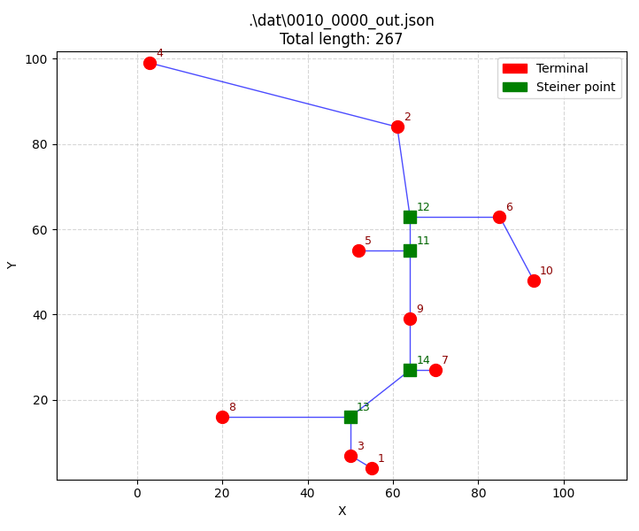
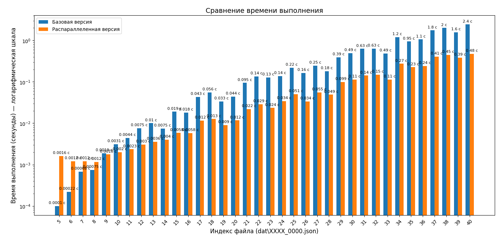

# RSMT Steiner

## Требования

- CMake
- Компилятор с поддержкой C++17 и OpenMP
- Python (для визуализации)

## Сборка (Windows)

```bat
git clone https://github.com/Teppy381/RSMT_Steiner.git
cd RSMT_Steiner
cmake -B build
cmake --build build
```

Исполняемый файл: `build\rsmt_steiner.exe`.

## Использование

JSON‑файлы для тестов находятся в папке **dat/**.

Базовый алгоритм:

```cmd
.\build\rsmt_steiner.exe .\dat\{filename}.json
```

Параллельный алгоритм (с OpenMP):

```cmd
.\build\rsmt_steiner.exe -m .\dat\{filename}.json
```

Визуализация результата (требуется Python 3 и matplotlib):

```cmd
python3 viz.py .\dat\{filename}_out.json
```



## Тестирование

Скрипт `test_all.bat` прогоняет все примеры из папки `dat/`.

```cmd
test_all.bat
```

Результаты времени исполнения сохраняются в файлы `log.log` (базовый алгоритм) и `log-m.log` (параллельный алгоритм).

После этого можно визуализировать время исполнения на графике с помощью скрипта `compare-logs.py`.

```cmd
python3 compare-logs.py
```



## Модификация алгоритма
Самым простым и действенным методом является распараллеливание цикла перебора кандидатов Ха́нана с помощью OpenMP. При 8 потоках достигается ускорение вплоть до 6 раз по сравнению с однопоточной версией. На малых графах скорость параллельного алгоритма может быть даже ниже, чем у однопоточного.
